# Introduccioón a las bases de datos 

**¿Qué es un dato?**
> Son palabras y/o números que se integran entre sí para estructurar información, que queremos guardas para posteriormente consultar o realizar alguna acción con ella. 

**¿Cuál es su definición?**
> Las bases de datos son un conjunto de información que se organiza de tal manera para ser utilizado de forma eficiente

**Objetivo de base de datos**
> El objetivo de las bases de datos es generar un mecanismo de almacenamiento de datos que permitan que la información sea recopilada, organizada, ordenada, almacenada, procesada y consultada de forma ágil, de manera que brinde soporte a la toma de decisiones. 
----

## Tipos de bases de datos 

### Bases de datos estáticas
Comúnmente utilizadas por la inteligencia empresarial y departamentos de análisis histórico, son bases de datos solamente de lectura, de las cuales se puede sustraer información, pero no modificar la ya existente.  

### Bases de datos dinámicas 
**Según su variabilidad**
**A demás de sustraer información se puede:** 
- Actualización 
- Reestructuración
- Eliminación o adición de información 

### Bases de datos bibliográficas
**Según su variabilidad**

Contiene diverso material de lectura ordenado con datos clave como:
- Datos de autor
- Datos del editor
- Año de aparición 
- Temática

### Bases de datos de texto completo
**Según su variabilidad** 

Generalmente son utilizados para escritos historicos o tipo ducumental.
Por lo que su conservación es prioritaria en todos los niveles y funge como **fuentes primarias**

**Ejemplo:**

- Compendiendios de libros, periódicos y revistas

El usuario es responsable de su busqueda en los compendios de estos que están almacenados dentro de la base de datos. 

### Base de datos de directorios 
**Según su variabilidad**

**Contienen grandes cantidades de datos personales como:**
* Correos electrónicos 
* Números telefónicos

Para esto el diseñador de las bases de datos debe hacer un **Módelo** del cual puedan almacenarse, para moder consultarlo en cualquier momento.
Una ventaja de estos módelos es que se pueden hacer consultas rápidas y eficientes ya que la estructura es la que permite hacer las altas, consultas, cambios y bajas de las bases de datos. 

### Bases de datos especializadas 
**Según su variabilidad**

* Son de información técnica tomando en cuenta un sector que lleva necesidades específicas con frecuencia.

* Estan relacionadas con otras para solucionar lo que el usuario necesita. 

* Se encuentran conectadas con varias fuentes de información para lograr las métas organizacionales. 

---

## Modelos de datos y su arquitectura

### Modelo de datos
Un modelo de datos es un conjunto de herramientas conceptuales que describen las características de los datos, sus relaciones entre sí, así como sus restricciones.

### Modelos conceptuales 
Son empleados para describir los datos de manera general. Este modelo presenta los datos de forma similar a como las personas entienden y visualizan el mundo real. 

Una de sus ventajas, es la capacidad de estructuración, la cual se caracteriza por ser flexible y permitir a su vez la precisión de restricciones de datos literales.

### Modelos lógicos tradicionales 
Luis Hueso (2014) afirma que los modelos tradicionales fueron los primeros en usarse, aunque su empleo en la actualidad sea extenso. Por otra parte, nos dice que estos se utilizan para describir datos a nivel global y de manera lógica. 

De los cuales, los tres más aceptados son:

* Modelo relacional
* Modelo de red
* Modelo jerárquico.

### Modelos lógicos avanzados 
Hueso Ibáñez expone lo siguiente en cuanto a este tipo de modelos: “Son modelos de datos relativamente recientes y cada vez más utilizados sobre todo en aplicaciones específicas que manejan nuevos y más complejos tipos de datos” (Hueso Ibáñez, 2014, p. 25).

### Arquitectura de una base de datos 

Para comprender la arquitectura de las bases de datos, es importante que se conozcan los modelos de datos, ya que estos son los que manipularán la información contenida en los gestores; para así, proveer al usuario de lo que requiere y para ello, es necesario saber que una arquitectura de base de datos se divide en tres niveles:

1. Nivel externo: el usuario final puede ver e interactuar con otros mediante las interfaces desarrolladas para su uso de una manera sencilla.
2. Nivel conceptual: es el nivel donde interactúan los datos con el código de las aplicaciones que utilizan los usuarios finales
3. Nivel interno: es el más cercano al almacenamiento físico de los datos que utilizan los gestores de bases de datos. Por otro lado, este nivel se encuentra totalmente alejado del usuario y solo relaciona los datos con los requerimientos de la aplicación. Es importante mencionar que se puede manipular la información con diferentes modelos y niveles de abstracción.

---
## Modelos de bases de datos 
> Un modelo de base de datos se utiliza para mostrar la estructura lógica, las relaciones y las limitaciones en la manera de almacenar la información y cómo se accederá a ella 

### Archivos simples 
El procesamiento tradiconal de sistemas de información, basa su operacion en estructuracion de archivos, que soporta los datos almacenados, las bases para el procesamiento, y la generación de informes útiles del usuario derivados del sistema 

### Modelo Jerarquico 
Se emplea para organizar datos en una estructura arbórea, cada registro tiene un solo elemento raíz, que sirve para clasificar los elementos en un orden específico, este orden se usa al nivel de un orden especifico, este nivel se utiliza a nivel de orden fisico para almacenar la base de datos. Dicha estructura es de gran ayuda para describir las relaciones que se dan en la vida real. El modelo se utilizó principalmente en la decada de los 60 y 70s, por lo que el día de hoy es muy raro que se sigan empleando debido a su eficiencia inestable. 

### Modelo de red
Este modelo se basa en el modelo jerarquico, lo cual permite relaciones de muchos a muchos entre registros vinculados y por ende, implica que se de registros principales multiples basado en la teoria de conjuntos matematicos, el modelo se construye con modelos de registros relacionados y a partir de estos cada conjunto consiste en un principal o propietario, y uno o más registros secundarios o miembros, un registro puede representar relaciones complejas 

### Modelo relacional 
Es el modelo más común, ya que se refiere al ordenamiento de todos los datos en tablas, conocidas también como relaciones, y estas a su vez se componen de filas y columnas, cabe destacar que cada columna enumera un atributo de la entidad, al conjunto de los atributos en relación, se les conoce como *dominios*. 

### Modelos orientado a objetos 
Este modelos se define mediante una colección de objetos o elementos de software reutilizables con acciones, es decir, metodos y funciones relacionados. Hay varios tipos de bases de datos orientada a objetos, como lo son: 
1. **Multimedia** 
   Es la que incorpora elementos gráficos que no se pueden almacenar en una base de datos de tipo relacional
2. **Hipertexto**
    Permite que cualquier objeto se conecte a cualquier otro, es de gran ayuda para organizar bases de datos diferentes, pero no es ideal para analizar análisis numéricos.  

### Modelo no relacional 
Con los nuevos requerimientos del *Big Data*, las bases de datos relacionales, no pueden manejar el tamaño, la complejidad de los formatos,  o la velocidad de entrega que requieren muchas aplicaciones como facebook o twitter, precisamente son estas aplicaciones las que han propiciado la aparicion de nuevos sistemas de bases de datos llamados *NoSQL*, estas bases de datos permiten dar solución a los retos de escalabilidad y rendimiento que representa el *Big data*, dicho concepto agrupa diferentes tipos de soluciones para distintos tipos de datos, desde tablas y gráficos, hasta documentos e imágenes, cualquier base de datos *NoSQL* es por definición *distribuida o escalable*. 

---

## Componentes del diseño de bases de datos 

### Diseño de bases de datos 

Los **_sistemas de información_** actuales representan el mundo real y permiten obtener información de todos los procesos que los rodean. Una ventaja de estos es que ayudan a ver el **_comportamiento_** de todo lo que existe alrededor de forma **_esquemática_**, de tal manera que, se puedan **_tomar decisiones_** o **_analizar_** la conducta de un grupo de personas, de un organización, etc.  

Para ello, es importante que los encargados de examinar los datos, los procesos o las actividades sean muy analíticos para trasladarlos a los sistemas de información, esto con la finalidsad, de que no existan problemas en los **_dominios estructurales_** (**_Espacio virtual_** que puede ser **_administrado_** para proveer **_información_** con **_seguridad_*), los cuales, manejan los datos y evitan problemas en la estructura. 

Cuando se habla del término **_analítica_** en el campo de los sistemas de información, se hace referencia a un conjunto de actividades de **_análisis_** que posibilitan el desarrollo de diferentes **_modelos y esquemas_** en la parte lógica (descripción de la estructura que se usa para ordenar los datos mediante la representación de esquemas), para dar lugar a la parte física (espacio de almacenamiento en donde se guarda la información de la base de datos). Esta información almacenada, es manipulada por el **_Sistema Gestor de Bases de Datos_**, también conocido como DBMS- Database Management System, por sus siglas en inglés; el cual, es un sistema informático que puede estar integrado de **_varios programas_** o funcionalidades que facilitan **_diseñar, crear, consultar o modificar_** una base de datos.

--- 

### Diseño lógico

Los componentes del **_diseño lógico_** de una base de datos se utilizan para **_esquematizar_** el **_modelo de negocio_** (esquema o representación gráfica que contiene la estructura de los datos, sus relaciones, atributos, etc.)  que permite dar forma al **_diseño conceptual_** de la base de datos, de tal manera que, se realice el **_diseño físico_** encaminado a que el **_Sistema Gestor de Base de Datos_** pueda manipular los mismos y genere información adecuada para el usuario final.

Por ejemplo, imagina que vas a crear una base de datos, primero tomas una hoja en blanco y con un lápiz formarás un diagrama que aterrice la lógica que tu mente te requiere; supongamos que quieres hacer una base de datos sencilla para crear un inventario de productos por lo que te preguntas lo siguiente: ¿qué información requiero almacenar?, ¿qué características va a tener cada dato a almacenar?, ¿qué necesito? Tal vez podrías requerir el número de producto, su descripción, la categoría, el costo, precio y número de piezas en existencia.

En este sentido, lo que haces en papel sería un **_diseño conceptual_**, el cual se puede llevar a la computadora para convertirlo en un **_esquema lógico_** que represente cómo va a funcionar y relacionarse esa información. Ahora piensa que esto podría colocarse en una hoja de cálculo en forma de tabla, con columnas o campos y en cada uno, deberás especificar el tipo de dato permitido para que se guarden consistentes y lógicos, a esto se le llama atributo. El **_atributo_** en el caso del campo o columna titulada **_número de piezas_**, obligatoriamente deberá ser **_numérico_**. Cuando creas la **_hoja de cálculo_** o **_tabla_** estás haciendo un **_diseño lógico_**, y cuando decides lo que vas a guardar en una **_carpeta compartida_** con acceso para varias personas, estás definiendo el **_espacio físico_** de almacenamiento de esa sencilla base de datos.

---

### Diseño físico 

El **_diseño físico_** de las bases de datos (descripción del esquema donde físicamente residirá la base de datos) es el encargado de la **_optimización_** del rendimiento de los recursos de **_hardware_** (uso eficiente del espacio para que sea accesible la información), mediante la correcta **_aplicación_** de las **_reglas de negocio_**  (indicaciones sobre dónde debe residir, quién puede tener acceso, con qué fin, cómo y cuándo puede ser consultada o manipulada la base de datos), **_con el fin de asegurar la integridad de los datos almacenados_** (verificar que los datos sean consistentes y coherentes; por ejemplo, si el campo es numérico no debería haber caracteres como letras en este campo) y evitar repeticiones innecesarias de datos, para proveer la información adecuada al usuario, todo esto con base en un diseño lógico adecuado y eficiente.

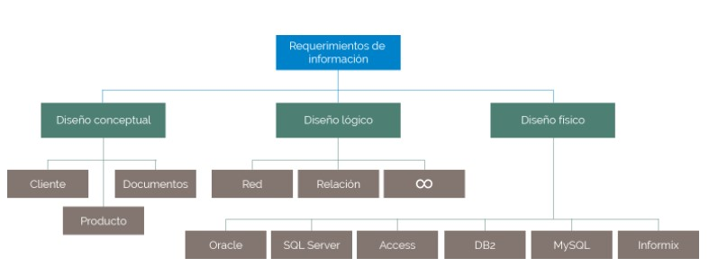

--- 

## Componentes del diseño lógico 

### Modelo Entidad-Relación 

El modelo de Entidad - Relación, consiste en una representación analítica de lo que se quiere almacenar en la base de datos y se encuentra compuesto por: entidades, atributos, relaciones y reglas de negocio. Todos estos elementos ayudarán al diseñador lógico a interpetar como se podrán relacionar las entidades dentro del modelo. 

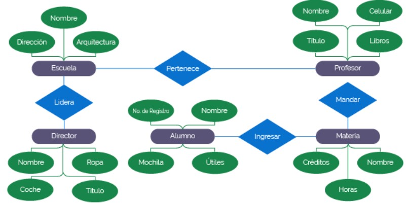

* **Entidad**
    Se deine como la representación de un objeto, proceso o concepto el mundo real que se describe en una base de datos para ser utilizada dentro de un modelado con la finalidad de brindad información sobre la entidad que se definirá. Asimismo, tienen una serie de características que definirán su estado, las cuales, son llamadas atributos. 

* **Atributo** 
    Son las características de las entidades que serán definidas den el modelo, por otra parte, son elementos que las definen y a su vez, se almacenan en el modelado. Cabe destacar, que un analista especializado puede encontrar todas estas características que definen entidades del mismo tipo, es decir, para que existan varios elementos de la misma entidad, los valores de los atributos o características tienen que ser diferentes entre sí, para poder determinar el estado de la entidad que se definirá.

* **Relaciones**
    Las relaciones son parte fundammental del **Modelo Entidad-Relación** y se definen como el grado de asociación entre una o varias entidades que se pueden instanciar. Así mismo, estas se pueden representar en forma de tablas para clarificar las reglas de negocio de acuerdo con el uso dque se le dará a la base de datos 
    
    - **Existen distintos tipos de relaciones**
        1. _**Relación de uno a uno**_
            Son relaciones donde se determina que una entidad se relaciona con otra, po ejemplo, una mujer s evincunla con un hombre de una relación llamada matrimonio. Es uno a auno por que un hombre solo puede estar casado con una mujer. 
            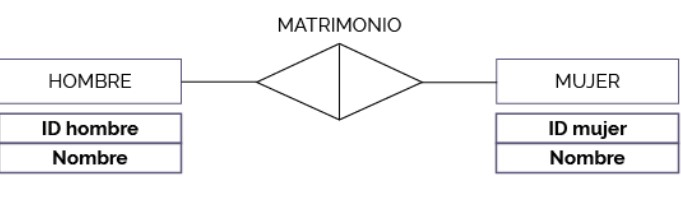

        2. _**Relación de uno a muchos**_
            Son relaciones donde se determina que una entidad se relaciona con muchas ebtudades de otro tipo. Por ejemplo, una empresas puede tener muchos empleados, pero, en este caso un empleado por si solo puede pertenecer a una empresa. Otro ejemplo es, que una mamá puede tener varios hijos, pero un hijo no puede tener varias mamás. 
            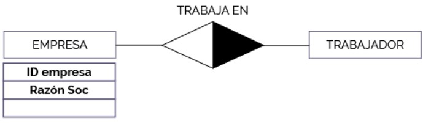

        3. _**Relación de muchos a muchos**_ 
            Son relaciones donde la entidad A se relaciona con miuchas entidades B y una entidad B se relaciona con muchas entidades A. Por ejemplo, un alumno se puede matricular en muchas asignaturas y una asignatura la pueden tomar muchos alumnos. 
            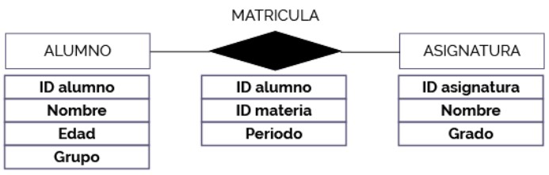

---

## Componentes del diseño físico
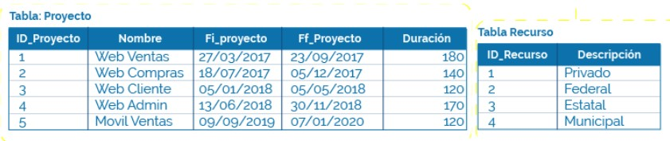
En general los compomnentes del diseño físico de las bases de datos son: 
- **Tablas**
    Las tablas son las que almacenan la información dentro de la base de datos. El siguiente esquema muestra tablas relacionadas, las cuales guardan información de los empleados y los proyectos en los qu participan. 
    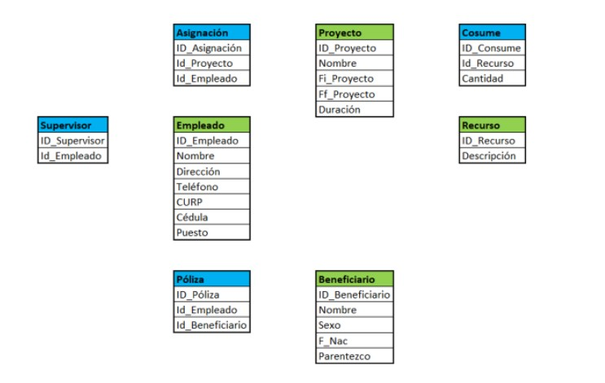
    >En este esquema se puede apreciar que cada tabla tiene un nombre y una serie de datos o campos. 

- **Columnas**
    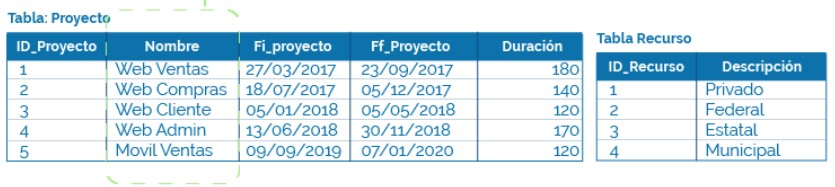

    Las columnas de la tabla son las que describen los atributos de la entidad (en un diagrama de entidad-relación), la cual se representa con una tabla.
    En sintesis, una columna es una conjunto de datos que almacena un mismo tipo de información, esto es que las columnas identifican los atributos de las entidades. 
    
    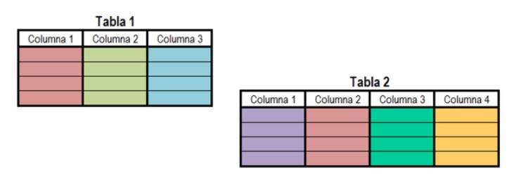

- **Tipo de datos**
    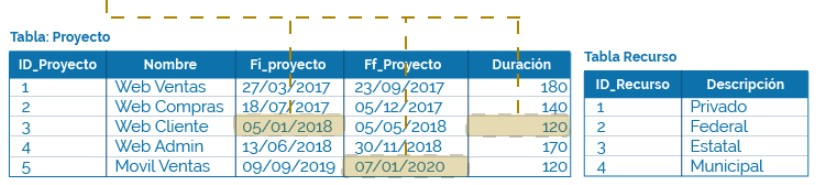
    Cada columna tiene un nombre y una serie de caracteristicas especificas, entre ellas el tipo de dato, el cual especifica que información puede tomar cada columna. 

    El nombre de la columna y el tipo de dato son definidos por el diseñador en la base de datos, ya que al hacer el análisis, él es quien determina el tipo de información que se almacenará en es columna. 
    Existen 2 tipos de datos: 
    - De datos escalares
    - De datos númericos
    #### Datos escalares
    Los datos escalares se refieren a un conjunto predefinido con una definición de datos especifica y se caracterizan por poder almacenar palabras o valores con los cuales no se puede hacer operaciones matemáticas, por ejemplo: 
        1. **Booleano**: solo puede almacenar cierto o falso
        2. **Caracter**: almacena solo un bit, es decir, un uno (1) o un cero (0), sin embargo, no se pueden realizar operaciones mátematicas con estos porque representan un valor binario. 

    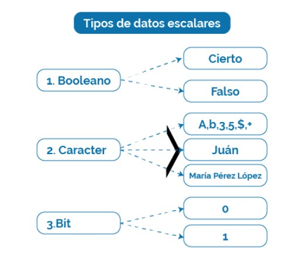
    #### Datos numéricos 
    Los datos numéricos que almacenan, como su nombre lo dice, guardan valores los cuales se pueden realizar operaciones matemáticas, por ejemplo: 
    - **Exacto:** solo almacena digitos de 0 a 9.
    - **Aproximados:** solo almacena valores aproximados por ejemplo el valor de $\pi$ o $e$
    - **fecha y hora**: almacena fechas, horas o ambas juntas
     

     

