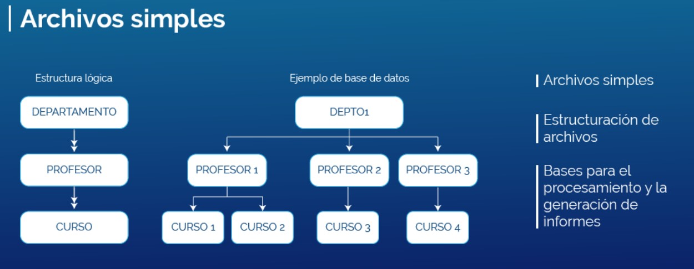
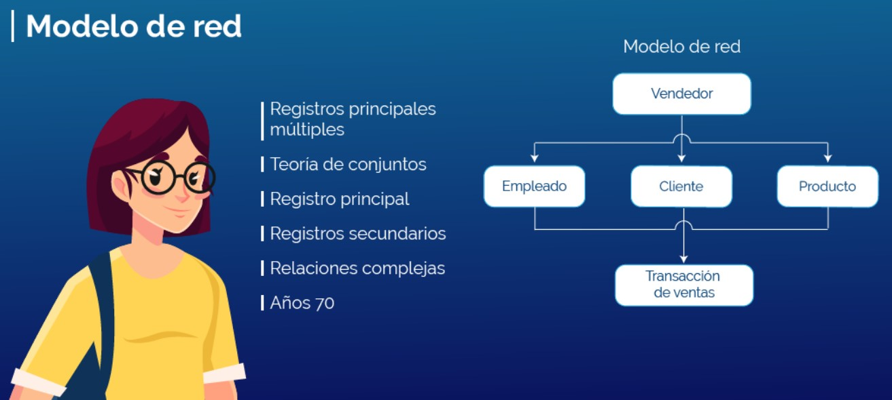
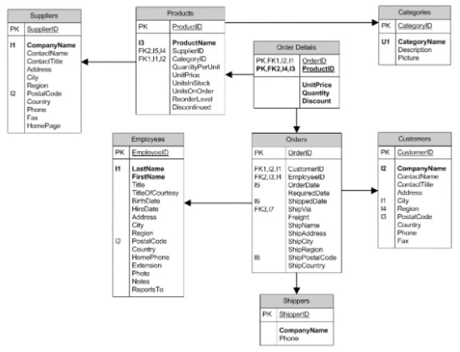

# Introduccioón a las bases de datos 

**¿Qué es un dato?**
> Son palabras y/o números que se integran entre sí para estructurar información, que queremos guardas para posteriormente consultar o realizar alguna acción con ella. 

**¿Cuál es su definición?**
> Las bases de datos son un conjunto de información que se organiza de tal manera para ser utilizado de forma eficiente

**Objetivo de base de datos**
> El objetivo de las bases de datos es generar un mecanismo de almacenamiento de datos que permitan que la información sea recopilada, organizada, ordenada, almacenada, procesada y consultada de forma ágil, de manera que brinde soporte a la toma de decisiones. 
----

## Tipos de bases de datos 

### Bases de datos estáticas
Comúnmente utilizadas por la inteligencia empresarial y departamentos de análisis histórico, son bases de datos solamente de lectura, de las cuales se puede sustraer información, pero no modificar la ya existente.  

### Bases de datos dinámicas 
**Según su variabilidad**
**A demás de sustraer información se puede:** 
- Actualización 
- Reestructuración
- Eliminación o adición de información 

### Bases de datos bibliográficas
**Según su variabilidad**

Contiene diverso material de lectura ordenado con datos clave como:
- Datos de autor
- Datos del editor
- Año de aparición 
- Temática

### Bases de datos de texto completo
**Según su variabilidad** 

Generalmente son utilizados para escritos historicos o tipo ducumental.
Por lo que su conservación es prioritaria en todos los niveles y funge como **fuentes primarias**

**Ejemplo:**

- Compendiendios de libros, periódicos y revistas

El usuario es responsable de su busqueda en los compendios de estos que están almacenados dentro de la base de datos. 

### Base de datos de directorios 
**Según su variabilidad**

**Contienen grandes cantidades de datos personales como:**
* Correos electrónicos 
* Números telefónicos

Para esto el diseñador de las bases de datos debe hacer un **Módelo** del cual puedan almacenarse, para moder consultarlo en cualquier momento.
Una ventaja de estos módelos es que se pueden hacer consultas rápidas y eficientes ya que la estructura es la que permite hacer las altas, consultas, cambios y bajas de las bases de datos. 

### Bases de datos especializadas 
**Según su variabilidad**

* Son de información técnica tomando en cuenta un sector que lleva necesidades específicas con frecuencia.

* Estan relacionadas con otras para solucionar lo que el usuario necesita. 

* Se encuentran conectadas con varias fuentes de información para lograr las métas organizacionales. 

---

## Modelos de datos y su arquitectura

### Modelo de datos
Un modelo de datos es un conjunto de herramientas conceptuales que describen las características de los datos, sus relaciones entre sí, así como sus restricciones.

### Modelos conceptuales 
Son empleados para describir los datos de manera general. Este modelo presenta los datos de forma similar a como las personas entienden y visualizan el mundo real. 

Una de sus ventajas, es la capacidad de estructuración, la cual se caracteriza por ser flexible y permitir a su vez la precisión de restricciones de datos literales.

### Modelos lógicos tradicionales 
Luis Hueso (2014) afirma que los modelos tradicionales fueron los primeros en usarse, aunque su empleo en la actualidad sea extenso. Por otra parte, nos dice que estos se utilizan para describir datos a nivel global y de manera lógica. 

De los cuales, los tres más aceptados son:

* Modelo relacional
* Modelo de red
* Modelo jerárquico.

### Modelos lógicos avanzados 
Hueso Ibáñez expone lo siguiente en cuanto a este tipo de modelos: “Son modelos de datos relativamente recientes y cada vez más utilizados sobre todo en aplicaciones específicas que manejan nuevos y más complejos tipos de datos” (Hueso Ibáñez, 2014, p. 25).

### Arquitectura de una base de datos 

Para comprender la arquitectura de las bases de datos, es importante que se conozcan los modelos de datos, ya que estos son los que manipularán la información contenida en los gestores; para así, proveer al usuario de lo que requiere y para ello, es necesario saber que una arquitectura de base de datos se divide en tres niveles:

1. Nivel externo: el usuario final puede ver e interactuar con otros mediante las interfaces desarrolladas para su uso de una manera sencilla.
2. Nivel conceptual: es el nivel donde interactúan los datos con el código de las aplicaciones que utilizan los usuarios finales
3. Nivel interno: es el más cercano al almacenamiento físico de los datos que utilizan los gestores de bases de datos. Por otro lado, este nivel se encuentra totalmente alejado del usuario y solo relaciona los datos con los requerimientos de la aplicación. Es importante mencionar que se puede manipular la información con diferentes modelos y niveles de abstracción.

---
## Modelos de bases de datos 
> Un modelo de base de datos se utiliza para mostrar la estructura lógica, las relaciones y las limitaciones en la manera de almacenar la información y cómo se accederá a ella 

### Archivos simples 
El procesamiento tradiconal de sistemas de información, basa su operacion en estructuracion de archivos, que soporta los datos almacenados, las bases para el procesamiento, y la generación de informes útiles del usuario derivados del sistema 

### Modelo Jerarquico 
Se emplea para organizar datos en una estructura arbórea, cada registro tiene un solo elemento raíz, que sirve para clasificar los elementos en un orden específico, este orden se usa al nivel de un orden especifico, este nivel se utiliza a nivel de orden fisico para almacenar la base de datos. Dicha estructura es de gran ayuda para describir las relaciones que se dan en la vida real. El modelo se utilizó principalmente en la decada de los 60 y 70s, por lo que el día de hoy es muy raro que se sigan empleando debido a su eficiencia inestable. 

### Modelo de red
Este modelo se basa en el modelo jerarquico, lo cual permite relaciones de muchos a muchos entre registros vinculados y por ende, implica que se de registros principales multiples basado en la teoria de conjuntos matematicos, el modelo se construye con modelos de registros relacionados y a partir de estos cada conjunto consiste en un principal o propietario, y uno o más registros secundarios o miembros, un registro puede representar relaciones complejas 

### Modelo relacional 
Es el modelo más común, ya que se refiere al ordenamiento de todos los datos en tablas, conocidas también como relaciones, y estas a su vez se componen de filas y columnas, cabe destacar que cada columna enumera un atributo de la entidad, al conjunto de los atributos en relación, se les conoce como *dominios*. 

### Modelos orientado a objetos 
Este modelos se define mediante una colección de objetos o elementos de software reutilizables con acciones, es decir, metodos y funciones relacionados. Hay varios tipos de bases de datos orientada a objetos, como lo son: 
1. **Multimedia** 
   Es la que incorpora elementos gráficos que no se pueden almacenar en una base de datos de tipo relacional
2. **Hipertexto**
    Permite que cualquier objeto se conecte a cualquier otro, es de gran ayuda para organizar bases de datos diferentes, pero no es ideal para analizar análisis numéricos.  

### Modelo no relacional 
Con los nuevos requerimientos del *Big Data*, las bases de datos relacionales, no pueden manejar el tamaño, la complejidad de los formatos,  o la velocidad de entrega que requieren muchas aplicaciones como facebook o twitter, precisamente son estas aplicaciones las que han propiciado la aparicion de nuevos sistemas de bases de datos llamados *NoSQL*, estas bases de datos permiten dar solución a los retos de escalabilidad y rendimiento que representa el *Big data*, dicho concepto agrupa diferentes tipos de soluciones para distintos tipos de datos, desde tablas y gráficos, hasta documentos e imágenes, cualquier base de datos *NoSQL* es por definición *distribuida o escalable*. 

